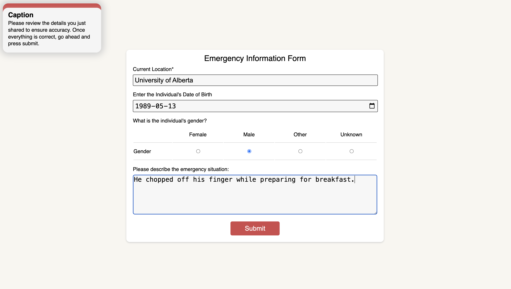
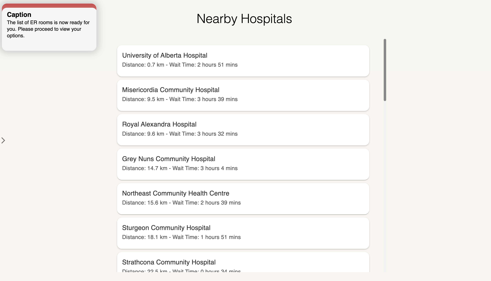
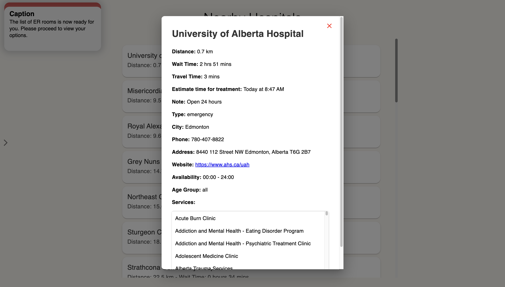

# FindER: Emergency Room Locator

## Role of FindER in Canadian Health Care System

FindER is a dynamic web application designed to optimize emergency room visits. It calculates the shortest total time (wait time + travel time) and examines the distinct services provided by different emergency rooms. Then, depending on the emergency situations, the application chooses the most appropriate emergency room tailored for the user's emergency. This platform is particularly beneficial in countries like Canada, where publicly funded healthcare systems often face long waiting times. By directing patients to the most efficient and appropriate emergency room, FindER not only enhances patient care but also reduces the strain on medical professionals and healthcare facilities.

## Straightforward, Yet Comprehensive Algorithm

The algorithm operates as follows:

1. **User Location**: Upon user consent, the site collects the user's current location.
2. **Data Collection**: Using web scraping, it gathers real-time wait times from hospitals across Alberta.
3. **User Input**: Users provide details such as age, gender, and the nature of the emergency.

4. **OpenAI Integration**: Inputs are fed into the OpenAI GPT-4 model to generate immediate care suggestions prior to arrival at the emergency room and assess the urgency of the situation.
5. **Google Maps API**: Calculates the travel time to potential hospitals.
6. **Hospital Ranking and Selection**: Hospitals are ranked based on total required time (travel time + wait time) for non-urgent cases or travel time alone for urgent cases. The app then evaluates whether the hospital's services align with the patient's needs before making a selection.

## Technologies Used

- **Web Scraping (BeautifukSoup & Selenium)**: To extract real-time data on hospital services, wait times, and operational hours.

- **JavaScript & React**: For building a responsive and interactive user interfact.
- **Node.js**: To handle server-side operations.
- **OpenAI GPT-4**: To assess the urgency of medical situations and provide prearrival advice.
- **Google Maps API**: To calculate travel times to various hospitals.
- **AWS Speech Recognition**: To enhance accessibility by allowing voice input for emergencies.
- **Amplify**: To deploy the web application.
- **Express**: To manage web application requests efficiently.

## Incorporation of GPT in HealthCare System

The OpenAI GPT-4 model is an optimal choice for assessing medical emergencies and providing pre-arrival advice in the FindER application due to its advanced understanding and contextual awareness, extensive training on diverse data, and ability to comprehend complex medical terminologies. Its continuous updates ensure up-to-date and relevant advice, while customizability enhances its effectiveness for emergency scenarios. GPT-4's scalability ensures it remains responsive during peak times, and its multilingual capabilities increase accessibility. Furthermore, its ethical guidelines and rigorous research support ensure safe and reliable outputs, making it a superior choice compared to other models for critical medical applications.

## Future Direction: Integration into Official Systems

While currently a tool for individuals facing medical emergencies, we aim to expand its functionalities to integrate with official healthcare systems like AHS or serve as a resource for medical professionals managing patient flow.

## Team and Roles

- **Dohyun Kim**: Frontend Developer - Focuses on creating a seamless and intuitive user interface.
- **Krish Lal**: Fullstack Developer - Bridges the gap between frontend and backend, ensuring smooth integration and functionality.
- **Adnan Nadeer**: Frontend Developer - Enhances the user experience with interactive and user-friendly design elements.
- **Meharpreet Singh Nanda**: Backend Developer - Manages server-side logic, ensuring robost and efficient backend operations.
- **Taekwan Yoon**: Backend Developer - Specializes in integrating various APIs and backend services to enhance the app's functionality.

[Devpost](https://devpost.com/software/finder-emergency-room-locator)
